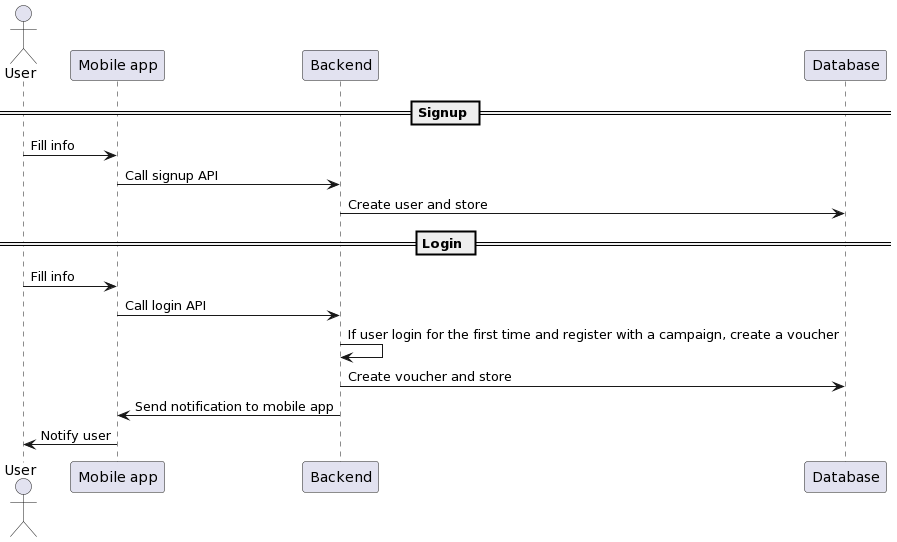

# Cake Assignment

## Develop on local

To start `mysql` and run migration using `flyway`:

```
docker-compose up -d mysql flyway
```

**Run Backend**:

```
go run ./cmd/app.go -config=cmd/app/config.dev.yml
```

**Or just**:

```
make build
docker compose up -d --build
```

## API Spec

Using `swagggo/swag` to generate.

Swagger file:

```
./handlers/docs/swagger.json
./handlers/docs/swagger.yaml
```

To view docs site:

```
http://localhost:8000/swagger/index.html
```

## Diagram

